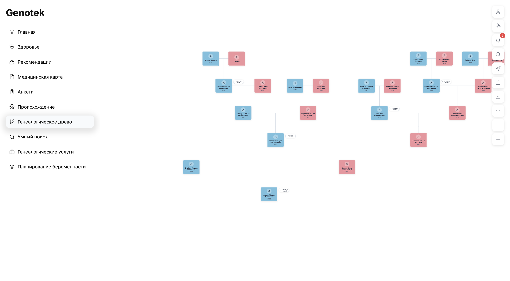
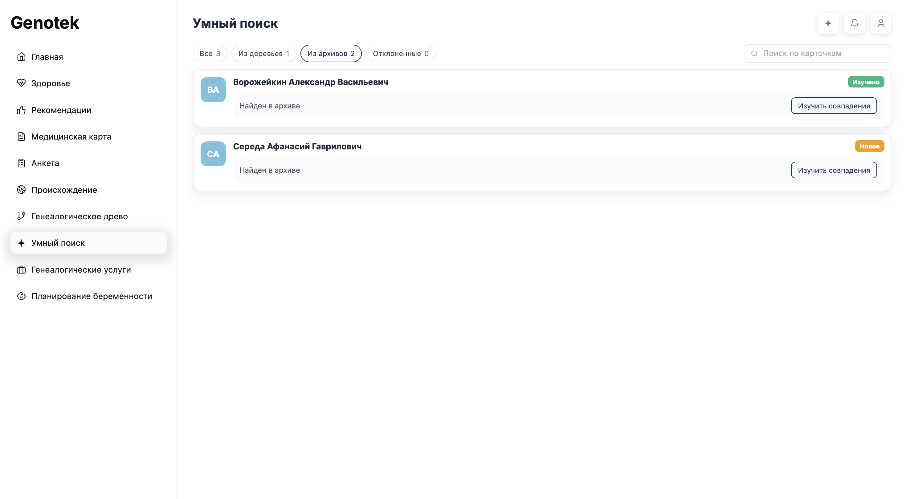

# Genotek: Умный поиск

Прототип функционала для построения и управления генеалогическим древом семьи с интеллектуальным поиском совпадений и интеграцией с архивными данными.

## Возможности

### Основные функции
- 🌳 Визуализация семейного древа с автоматическим расчётом позиций
- 👤 Карточки с информацией о членах семьи
- ✏️ Редактирование данных (ФИО, дата и место рождения, описание)
- ➕ Добавление родственников (партнёр, отец, мать, сын, дочь)
- 🗑️ Удаление записей с автоматическим обновлением связей
- 💾 Единое хранение в database.json (формат example.json)

### 🔄 SmartMatching — Умный поиск родственников
- Поиск совпадений с деревьями других пользователей
- Использование алгоритма нечёткого сравнения (RapidFuzz)
- Сравнение по ФИО, дате и месту рождения
- Возможность добавить найденных предков в своё древо одним нажатием
- Система подписок для доступа к данным других пользователей
- Запрос доступа к приватным деревьям

### 📜 Архивные парсеры
- Интеграция с архивом «Память народа» (`pamyat_parser.py`)
- Интеграция с «Герои великой войны» (`gwar_parser.py`)
- Интеграция с «Открытый список» (`openlist_parser.py`)
- Единый формат архивных совпадений для UI

### 🎨 Современный UX/UI
- Интерактивное древо с drag-and-drop навигацией
- Масштабирование и центрирование дерева
- Цветовое кодирование по полу (голубой/розовый)
- Индикаторы найденных совпадений на карточках
- Модальные окна для редактирования и верификации совпадений
- Система уведомлений
- Обучающий тур по SmartMatching

## Структура проекта

```
Genotek/
├── server/                    # Backend (Node.js + Express)
├── client/                    # Frontend (React + Vite)
├── smart_matching.py          # Модуль SmartMatching (Python)
├── pamyat_parser.py           # Парсер Память Народа
├── gwar_parser.py             # Парсер Герои Великой войны
├── openlist_parser.py         # Парсер Открытый список
├── trees/                     # Локальные GEDCOM-файлы (gitignored)
├── database.json              # Локальное хранилище (gitignored)
├── example.json               # Локальный пример данных (gitignored)
└── README.md
```

## Установка и запуск

### Требования
- Node.js 18+
- Python 3.8+
- pip

### 1. Установка зависимостей

#### Backend:
```bash
cd server
npm install
```

#### Frontend:
```bash
cd client
npm install
```

#### Python зависимости:
```bash
pip install rapidfuzz
```

### 2. Запуск приложения

#### Backend (в одном терминале):
```bash
cd server
node server.js
```
Сервер запустится на `http://localhost:3001`

#### Frontend (в другом терминале):
```bash
cd client
npm run dev
```
Приложение откроется на `http://localhost:5173`

## API Endpoints

### Люди и связи

| Метод | Путь | Описание |
|-------|------|----------|
| GET | /api/people | Получить всех людей |
| GET | /api/people/:id | Получить человека по ID |
| GET | /api/people/:id/family | Получить расширенную семейную карточку |
| POST | /api/people | Создать нового человека |
| PUT | /api/people/:id | Обновить данные человека |
| DELETE | /api/people/:id | Удалить человека и почистить связи |
| POST | /api/people/:id/relative | Добавить родственника (partner/father/mother/son/daughter) |
| POST | /api/trees/:treeId/merge | Объединить чужое дерево с текущим по найденным совпадениям |

#### POST `/api/people/:id/relative`

Пример `request`:

```json
{
  "relationType": "father",
  "relativeData": {
    "name": "Петр",
    "lastName": "Иванов",
    "middleName": "Сергеевич",
    "birthDate": "1960",
    "birthPlace": "Москва",
    "information": ""
  }
}
```

Пример `response`:

```json
{
  "person": { "id": "target_id" },
  "newRelative": { "id": "new_relative_id" }
}
```

#### POST `/api/trees/:treeId/merge`

Принимает все подтвержденные точки стыковки с одним деревом. Совпавшие люди и
существующие карточки не изменяются, отсутствующие родственники добавляются с
сохранением семейных связей. Повторный запрос идемпотентен.

```json
{
  "matches": [
    {
      "data_id": "person_in_current_tree",
      "database_id": "person_in_source_tree"
    }
  ]
}
```

Пример `response`:

```json
{
  "success": true,
  "treeId": "source_tree_id",
  "addedCount": 3,
  "addedPersonIds": ["new_person_1", "new_person_2", "new_person_3"],
  "conflicts": [],
  "people": {}
}
```

### SmartMatching и архивные источники

| Метод | Путь | Описание |
|-------|------|----------|
| POST | /api/smart-matching | Запустить поиск совпадений по деревьям и архивам |
| GET | /api/people/:id/matches | Получить кэш совпадений для персоны |
| POST | /api/people/:id/confirm-match | Подтвердить совпадение с чужим деревом |
| POST | /api/people/:id/confirm-archive-match | Подтвердить архивное совпадение |

#### POST `/api/smart-matching`

Пример `request`:

```json
{
  "personIds": ["person_1", "person_2"],
  "sources": {
    "userTrees": true,
    "pamyatNaroda": true,
    "openList": true,
    "gwar": false
  },
  "searchCriteria": {
    "fullName": true,
    "birthDate": true,
    "birthPlace": true
  }
}
```

Пример `response`:

```json
{
  "treeMatches": [],
  "archiveMatches": [],
  "matchedDataIds": ["person_1"],
  "processedPersonIds": ["person_1", "person_2"],
  "sources": [
    { "key": "userTrees", "label": "Деревья других пользователей" },
    { "key": "pamyatNaroda", "label": "Память народа" },
    { "key": "openList", "label": "Открытый список" }
  ],
  "searchCriteria": {
    "fullName": true,
    "birthDate": true,
    "birthPlace": true
  }
}
```

#### GET `/api/people/:id/matches`

Пример `response`:

```json
{
  "treeMatches": [],
  "archiveMatches": []
}
```

#### POST `/api/people/:id/confirm-match`

Пример `request`:

```json
{
  "match": {
    "database_id": "db_person_id",
    "people": {
      "db_person_id": { "id": "db_person_id" }
    }
  }
}
```

Пример `response`:

```json
{
  "success": true,
  "message": "Match confirmed and relatives added",
  "people": {}
}
```

#### POST `/api/people/:id/confirm-archive-match`

Пример `request`:

```json
{
  "match": {
    "person": {
      "birthDate": "1920",
      "birthPlace": "Москва",
      "information": "Архивные сведения..."
    }
  }
}
```

Пример `response`:

```json
{
  "success": true,
  "message": "Archive information added",
  "person": { "id": "person_1" }
}
```

### Импорт/экспорт базы

| Метод | Путь | Описание |
|-------|------|----------|
| POST | /api/database/upload | Загрузить `database.json` (массив import-записей) |
| GET | /api/database/export | Выгрузить `database.json` |

#### POST `/api/database/upload`

Поддерживает:
- массив записей import-формата;
- объект с полем `data`, содержащим массив записей.

Пример успешного `response`:

```json
{
  "success": true,
  "people": {},
  "records": 123
}
```

## Структура данных

### Человек (Person, API `/api/people`)

```json
{
  "id": "unique_id",
  "name": "Имя",
  "lastName": "Фамилия",
  "middleName": "Отчество",
  "gender": "male|female",
  "birthDate": "YYYY|YYYY-MM|YYYY-MM-DD",
  "birthPlace": "Город",
  "fatherId": "id_отца|null",
  "motherId": "id_матери|null",
  "partnerId": "id_партнёра|null",
  "children": ["id_ребёнка1", "id_ребёнка2"],
  "isAlive": true,
  "hasMatch": false,
  "information": "Описание или данные из архива",
  "documents": [],
  "sourceSearchCache": {
    "userTrees": {
      "searchedAt": "2026-05-16T10:00:00.000Z",
      "status": "matches_found|no_matches",
      "source": "userTrees",
      "sourceLabel": "Деревья других пользователей",
      "searchCriteria": {
        "fullName": true,
        "birthDate": true,
        "birthPlace": true
      },
      "matches": [],
      "errors": []
    }
  }
}
```

### Локальное хранилище (`database.json`)

`database.json` хранит массив записей в import-формате. Текущее дерево определяется автоматически (обычно по `patientId`), а при сохранении обновляется только текущее дерево.

```json
[
  {
    "_id": { "$oid": "person_1" },
    "treeId": { "$oid": "tree_main" },
    "patientId": true,
    "gender": "Male",
    "name": ["Иван"],
    "surname": ["Иванов"],
    "middleName": ["Иванович"],
    "birthdate": [{ "day": 1, "month": 1, "year": 1990 }],
    "birthplace": ["Москва"],
    "liveOrDead": 1,
    "relatives": [
      { "id": { "$oid": "person_2" }, "relationType": "parent" },
      { "id": { "$oid": "person_3" }, "relationType": "spouse" }
    ],
    "relationships": [
      {
        "with": { "$oid": "person_3" },
        "type": "official",
        "finished": null,
        "from": [{ "day": null, "month": null, "year": null }],
        "to": [{ "day": null, "month": null, "year": null }]
      }
    ],
    "hasMatch": false,
    "sourceSearchCache": {},
    "information": "Дополнительная информация",
    "documents": []
  }
]
```

### База деревьев других пользователей (`trees/`)

`trees/` содержит `.json` файлы в том же import-формате (массив записей). При поиске источник `userTrees` строится из файлов этой директории.

### Результат `/api/smart-matching`

```json
{
  "treeMatches": [
    {
      "data_id": "id_в_вашем_дереве",
      "tree_id": "id_дерева",
      "tree_owner": "Владелец дерева",
      "database_id": "id_в_другом_дереве",
      "score": 95.5,
      "people": {
        "db_person_id": {
          "id": "db_person_id",
          "name": "Иван",
          "lastName": "Иванов",
          "middleName": "Иванович",
          "gender": "male",
          "fatherId": null,
          "motherId": null,
          "partnerId": null,
          "children": [],
          "isAlive": true,
          "birthDate": "1910",
          "birthPlace": "Москва",
          "information": ""
        }
      }
    }
  ],
  "archiveMatches": [
    {
      "data_id": "id_в_вашем_дереве",
      "source": "pamyatNaroda|openList|gwar",
      "sourceLabel": "Память народа|Открытый список|Герои великой войны",
      "score": 92.3,
      "person": {
        "lastName": "Фамилия",
        "name": "Имя",
        "middleName": "Отчество",
        "birthDate": "1920",
        "birthPlace": "Место",
        "information": "AI-суммаризация архивных данных"
      },
      "records": [],
      "searchedAt": "2026-05-16T10:00:00.000Z"
    }
  ],
  "matchedDataIds": ["id1", "id2"],
  "processedPersonIds": ["id1", "id2"],
  "sources": [
    { "key": "userTrees", "label": "Деревья других пользователей" },
    { "key": "pamyatNaroda", "label": "Память народа" },
    { "key": "openList", "label": "Открытый список" },
    { "key": "gwar", "label": "Герои великой войны" }
  ],
  "searchCriteria": {
    "fullName": true,
    "birthDate": true,
    "birthPlace": true
  }
}
```

## Технологии

### Backend
- **Node.js** — серверная среда выполнения
- **Express** — веб-фреймворк
- **CORS** — кросс-доменные запросы
- **child_process** — запуск Python скриптов

### Frontend
- **React 18** — UI библиотека
- **Vite** — сборщик и dev-сервер
- **Lucide Icons** — иконки
- **CSS Variables** — тематизация
- **CSS Grid & Flexbox** — адаптивная вёрстка

### Python модули
- **RapidFuzz** — нечёткое сравнение строк
- **urllib/json/ssl/re** — сетевые запросы и парсинг ответов архивов

## Локальные файлы (не в Git)

В `.gitignore` добавлены локальные артефакты разработки:
- `database.json`
- `example.json`
- `trees/`
- `.cursor/`

## Алгоритм SmartMatching

SmartMatching сравнивает персон текущего дерева с персонами из источника `userTrees` и возвращает совпадения для фронта в едином формате.

Что делает модуль `smart_matching.py`:
- принимает текущих персон (`data`) и базу чужих деревьев (`db`);
- поддерживает два формата входа: `{"people": ...}` и import-массив с `_id/treeId/relatives`;
- считает score по набору полей с динамическими весами;
- передает сырые результаты серверу для фильтрации по настраиваемому порогу score;
- ограничивает выдачу `topKPerPerson`;
- для каждого совпадения добавляет `people`-фрагмент предков для подтверждения/импорта в текущее дерево.

### Взвешенная оценка

Алгоритм использует динамическое взвешивание — веса применяются только для полей с данными:

| Поле | Вес | Описание |
|------|-----|----------|
| **Фамилия** | 0.28 | Нечёткое сравнение (RapidFuzz) |
| **Имя** | 0.24 | Нечёткое сравнение (RapidFuzz) |
| **Дата рождения** | 0.28 | Сравнение с поддержкой диапазонов |
| **Отчество** | 0.10 | Только если указано хотя бы у одного |
| **Место рождения** | 0.10 | Триграммное сравнение с фильтрацией |
| **Девичья фамилия** | 0.12 | Только если указана у обеих персон |

Итоговый score = Σ(score_i × weight_i) / Σ(weight_i)

### Методы сравнения

#### 1. Текстовое сравнение (ФИО)
```python
# Нормализация: lowercase, удаление пунктуации, сжатие пробелов
# Алгоритм: token_sort_ratio из RapidFuzz
# При отсутствии данных: 70 (нейтральный score)
```

#### 2. Сравнение дат рождения
Поддерживает частичные даты:
- `1920` → диапазон 01.01.1920 – 31.12.1920
- `1920-05` / `05.1920` → весь май 1920 года
- `1920-05-15` → точная дата

В интерфейсе даты вводятся и отображаются как `гггг`, `мм.гггг` или `дд.мм.гггг`.
В API и хранилище они нормализуются в `YYYY`, `YYYY-MM` или `YYYY-MM-DD`, поэтому
неизвестные день и месяц не дополняются значениями `01.01`.

Логика сравнения:
| Условие | Score |
|---------|-------|
| Диапазоны пересекаются | 100 |
| Разница ≤ 1 года | 70 |
| Разница > 1 года | 0 |
| Данные отсутствуют | 50 |

#### 3. Сравнение мест рождения
Использует триграммный анализ с коэффициентом Жаккара:

1. **Токенизация** с фильтрацией стоп-слов:
   - Удаляются: г., город, с., село, деревня, пос., район, обл., область, край, республика, уезд, волость
   - Удаляются токены ≤ 2 символов

2. **Триграммы**: строка разбивается на 3-символьные подстроки
   - `"москва"` → `{"  м", " мо", "мос", "оск", "скв", "ква", "ва "}`

3. **Jaccard similarity**: |A ∩ B| / |A ∪ B|

4. **Финальный score**: 0.7 × best_match + 0.3 × average_match

| Jaccard | Score |
|---------|-------|
| ≥ 0.75 | 100 |
| ≥ 0.55 | 80 |
| ≥ 0.35 | 60 |
| ≥ 0.20 | 40 |
| < 0.20 | 0 |

### Пороги и выдача

- Порог совпадений между деревьями по умолчанию: `90%`.
- Порог совпадений с архивами по умолчанию: `80%`.
- Пороги настраиваются в админке и применяются по правилу `score >= threshold`.
- По умолчанию `topKPerPerson = 5`.
- Если `personIds` не передан, поиск идет по старшему поколению (персоны без родителей).

### Пример расчёта

```
Персона A: Иванов Иван Иванович, 1920, Москва
Персона B: Иванов Иван Иваныч, 1920-03, г. Москва

lastName:   fuzz("иванов", "иванов") = 100 × 0.28 = 28.0
name:       fuzz("иван", "иван") = 100 × 0.24 = 24.0
birthDate:  пересечение диапазонов = 100 × 0.28 = 28.0
middleName: fuzz("иванович", "иваныч") = 85 × 0.10 = 8.5
birthPlace: trigram("москва", "москва") = 100 × 0.10 = 10.0

Сумма весов: 0.28 + 0.24 + 0.28 + 0.10 + 0.10 = 1.00
Итого: 98.5%
```

## Скриншоты




## Лицензия

MIT
